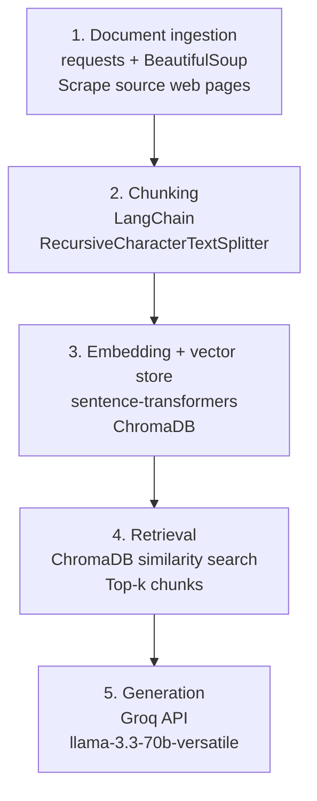

# Project 1 Planning: The Unofficial Guide

---

## Domain

<!-- What domain did you choose? Why is this knowledge valuable and hard to find through official channels? -->
My domain is UC Berkeley campus dining and food experiences, including dining halls, on-campus eateries, nearby restaurants, and student food resources. This knowledge is difficult to find in one place because official university websites provide basic information, but students often rely on scattered reviews, Reddit discussions, Yelp ratings, and personal recommendations to learn which options are actually affordable, convenient, and worth visiting. An unofficial guide can bring together these diverse perspectives to help students make informed dining choices.
---

## Documents

<!-- List your specific sources: URLs, subreddit names, forum threads, or file descriptions.
     Aim for at least 10 sources that together cover different subtopics or perspectives within your domain. -->

| # | Source | Description | URL or Location |
|---|--------|-------------|-----------------|
| 1 | Berkeleyside - Nosh Article "Freshmen Food Guide" | One of the most-read food guides for Berkeley newcomers. | [https://www.berkeleyside.org/2025/08/26/where-to-eat-if-you-are-new-to-berkeley](https://www.berkeleyside.org/2025/08/26/where-to-eat-if-you-are-new-to-berkeley) |
| 2 | UC Berkeley Dining Locations | Directory of dining halls, cafes, markets, and restaurants operated by Berkeley Dining. | [https://dining.berkeley.edu/locations](https://dining.berkeley.edu/locations) |
| 3 | Berkeley Life: Dining at UC Berkeley | Student-focused guide introducing dining options and food resources on campus. | [https://life.berkeley.edu/dining-at-uc-berkeley-where-to-eat](https://life.berkeley.edu/dining-at-uc-berkeley-where-to-eat) |
| 4 | UC Berkeley Foodscape Map | Interactive map of food resources, groceries, food pantries, and dining locations near campus. | [https://food.berkeley.edu/foodscape-map](https://food.berkeley.edu/foodscape-map) |
| 5 | UC Berkeley Basic Needs Center | Official resource for UC Berkeley students facing food insecurity. | [https://basicneeds.berkeley.edu](https://basicneeds.berkeley.edu) |
| 6 | Cal Student Store - Dining & Food | Information about on-campus food services and dining options. | [https://store.berkeley.edu/dining](https://store.berkeley.edu/dining) |
| 7 | Berkeley Food Institute Resources | Food policy and sustainability resources related to campus dining. | [https://food.berkeley.edu/about/](https://food.berkeley.edu/about/) |
| 8 | UC Berkeley Housing & Dining Handbook | Official guide for housing and dining options for residential students. | [https://housing.berkeley.edu/](https://housing.berkeley.edu/) |
| 9 | Berkeley Student Food Cooperative | Student-run food co-op offering affordable food options near campus. | [https://www.berkeleystudentfood.org/](https://www.berkeleystudentfood.org/) |
| 10 | Resident Student Services - Dining Info | Official dining information and resources for residential students. | [https://reslife.berkeley.edu/](https://reslife.berkeley.edu/) |

---

## Chunking Strategy

<!-- How will you split documents into chunks?
     State your chunk size (in tokens or characters), overlap size, and explain why those
     numbers fit the structure of your documents.
     A review-heavy corpus warrants different chunking than a long FAQ. -->

**Chunk size:** 2,000 characters

**Overlap:** 200 characters

**Reasoning:** This chunk size is well-suited for my sources because many documents contain short sections focused on specific restaurants, dining halls, or recommendations. The overlap helps preserve context when information spans chunk boundaries, reducing the risk of losing important details during retrieval.

---

## Retrieval Approach

<!-- Which embedding model are you using (e.g., all-MiniLM-L6-v2 via sentence-transformers)?
     How many chunks will you retrieve per query (top-k)?
     If you were deploying this for real users and cost wasn't a constraint, what tradeoffs
     would you weigh in choosing a different embedding model — context length, multilingual
     support, accuracy on domain-specific text, latency? -->

**Embedding model:** BAAI/bge-large-en

**Top-k:** I will retrieve the top 8 most relevant chunks for each query. This value balances recall and precision by returning enough information from multiple sources without overwhelming the system with irrelevant results.

**Production tradeoff reflection:** If I were deploying this system for real users and cost was not a constraint, I would evaluate alternative embedding models based on retrieval accuracy, context length, multilingual support, and latency. A larger or more specialized model could improve retrieval quality, especially for informal student-generated content, but may increase computational costs and response times. I would also consider adding a re-ranking stage to improve the relevance of the final retrieved results.

---

## Evaluation Plan

<!-- List your 5 test questions with their expected correct answers.
     Questions should be specific enough that you can judge whether the system's response
     is right or wrong. "What are good dining halls?" is too vague.
     "What do students say about wait times at [dining hall name] during lunch?" is testable. -->

| # | Question | Expected answer |
|---|----------|-----------------|
| 1 | What are the names of UC Berkeley's main dining commons listed on the official Dining Locations page? | Café 3, Clark Kerr, Crossroads, and Foothill. |
| 2 | According to Berkeleyside's "Freshmen Food Guide," what is recommended for an affordable lunch under $10 near campus? | Cheese 'N' Stuff, a small deli under the Telegraph-Channing parking garage, recommended for a fresh lunch for less than $10. |
| 3 | According to UC Berkeley's Dining Locations page, which convenience stores are listed alongside the dining commons? | Bear Market, CKCub, Cub Market, The Den, and Pizzeria 1868. |
| 4 | What types of food resources does UC Berkeley's Foodscape Map display near campus? | Food resources, groceries, food pantries, and dining locations near campus. |
| 5 | What resources does UC Berkeley's Basic Needs Center offer to help students afford groceries? | CalFresh (SNAP/EBT) application support, providing eligible students up to $298/month, plus a campus food pantry and emergency food relief. |

---

## Anticipated Challenges

<!-- What could go wrong? Name at least two specific risks with reasoning.
     Consider: noisy or inconsistent documents, missing source attribution, off-topic
     retrieval, chunks that split key information across boundaries. -->

1. Off-topic or noisy retrieval from Reddit and social media sources — r/berkeley contains a huge mix of unrelated topics (housing, classes, campus news, etc.), so a retrieval system could pull in irrelevant threads when searching for food-related content. Comments are also informal, sarcastic, or outdated, making it hard to distinguish genuinely useful recommendations from jokes or one-off complaints.

2. Inconsistent or missing source attribution across dynamic pages — sources like Yelp, Google Maps, and the Foodscape Map display constantly changing, user-generated content (reviews, ratings, hours) without clear timestamps or stable URLs for individual entries. If the system retrieves a snippet from these pages, it may be difficult to attribute it to a specific restaurant, review, or date, leading to outdated or unverifiable information being presented as current.

---

## Architecture

<!-- Draw a diagram of your pipeline showing the five stages:
     Document Ingestion → Chunking → Embedding + Vector Store → Retrieval → Generation
     Label each stage with the tool or library you're using.
     You can use ASCII art, a Mermaid diagram, or embed a sketch as an image.
     You'll use this diagram as context when prompting AI tools to implement each stage. -->

---

## AI Tool Plan

<!-- For each part of the pipeline below, describe:
     - Which AI tool you plan to use (Claude, Copilot, ChatGPT, etc.)
     - What you'll give it as input (which sections of this planning.md, which requirements)
     - What you expect it to produce
     - How you'll verify the output matches your spec

     "I'll use AI to help me code" is not a plan.
     "I'll give Claude my Chunking Strategy section and ask it to implement chunk_text()
     with my specified chunk size and overlap" is a plan. -->

**Milestone 3 — Ingestion and chunking:**

**Milestone 4 — Embedding and retrieval:**

**Milestone 5 — Generation and interface:**
